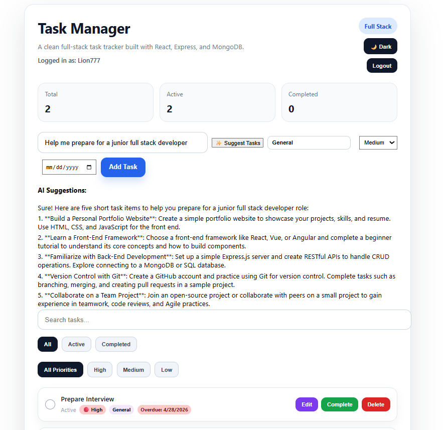

# 🚀 Task Manager App

A full-stack task management application built using React, Node.js, Express, and MongoDB.

## 🌐 Live Demo

https://task-manager-app-three-rho.vercel.app/

## 🎥 Demo Video
Includes login/register authentication (see screenshots below)

https://github.com/user-attachments/assets/ca099a12-a487-4fb4-8559-e4b58684fddb

## 📌 Overview
A full-stack task management app built with React, Express, Node.js, and MongoDB. Users can register, log in, create tasks, edit tasks, assign categories, set priorities, add due dates, search/filter tasks, reorder tasks with drag-and-drop, and toggle light/dark mode.
✨ Includes AI-powered task suggestions that generate actionable task lists based on user input using an external API.


## ✨ Features
- User authentication with JWT
- Create, edit, complete, delete tasks
- Task categories
- Priority levels: Low, Medium, High
- Due dates with overdue labels
- Search and filter by status/priority
- Drag-and-drop task reordering with saved order
- Light/dark mode with localStorage persistence
- Toast notifications
- Responsive UI polish with hover effects

  ## 🤖 AI Feature

Users can generate task suggestions by entering a goal (e.g., "Prepare for a junior full stack developer interview").  
The app sends the request to a backend API endpoint, which securely communicates with an AI service and returns structured task suggestions displayed in the UI.

This demonstrates:
- API integration
- Backend routing with Express
- Secure environment variable handling
- Frontend ↔ backend communication

## 🛠 Tech Stack

- Frontend: React
- Backend: Node.js, Express
- Database: MongoDB
- Authentication: JWT
- Deployment: Vercel (frontend), Render (backend)
- AI Integration: OpenAI API
  
## 📷 Screenshots

### Login


### Dashboard - Light Mode


### Dashboard - Dark Mode


 ## 🤖 AI-Powered Task Suggestions

 

 Users can generate intelligent, structured task suggestions based on their goals (e.g., "Prepare for a junior full stack developer interview"). This feature integrates a frontend React interface with a backend Express API that securely communicates with an AI service.

**Key concepts demonstrated:**
- API integration
- Backend routing with Express
- Secure environment variable handling
- Frontend ↔ backend communication

## ✍️ How to Run Locally

## 🚀 Getting Started

### 1. Clone the repository
```bash
git clone https://github.com/mdp101191-rgb/task-manager-app.git
cd task-manager-app

### 2. Start the backend
```bash
cd Backend
npm install
node server.js
```

### 3. Start the frontend
```bash
cd ../frontend
npm install
npm start
```

```md
## 🔐 Environment Variables

Create a `.env` file in the `Backend` folder with:

```env
MONGO_URI=your_mongodb_connection_string
PORT=5000
JWT_SECRET=your_secret_key
```
Make sure to replace the placeholder values with your actual credentials.

## 📚 What I Learned
- Built and deployed a full-stack app from frontend to backend
- Implemented JWT authentication and protected routes
- Connected React to a deployed Express/MongoDB API
- Debugged production deployment issues with Vercel and Render
- Added persistent drag-and-drop ordering
- Improved UI/UX with dark mode, toast notifications, and hover polish

## 🚀 Future Improvements
- Mobile layout improvements
- Per-user saved theme preference in MongoDB
- Task notes/subtasks
- Calendar view

## 👨‍💻 Author
**Marcos Peon**
