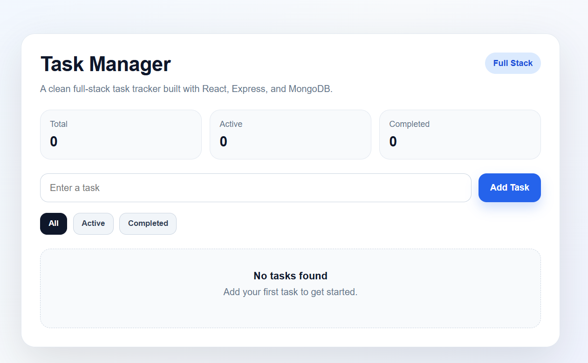
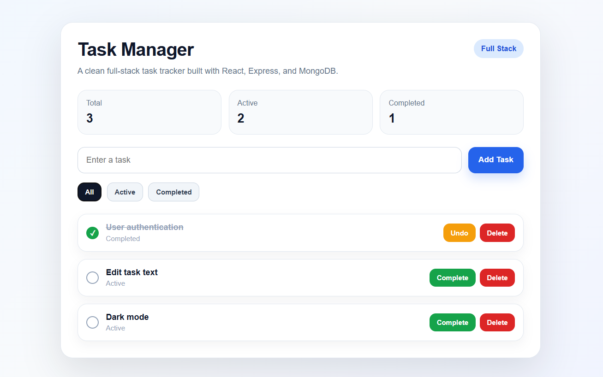

# 🚀 Task Manager App

Deployed full-stack application with a live frontend, API, and cloud database.

## 🌐 Live Demo
Frontend: [Live App](https://task-manager-app-three-rho.vercel.app/)
Backend API: [Live API](https://task-manager-app-y1cn.onrender.com)

## 📌 Overview
This project is a full-stack CRUD task manager that allows users to create, view, update, and delete tasks through a responsive frontend connected to a deployed backend and cloud database.

## 🛠 Tech Stack
- **Frontend:** React
- **Backend:** Node.js, Express
- **Database:** MongoDB Atlas
- **Deployment:** Vercel (frontend), Render (backend)
- **Version Control:** Git + GitHub
- **API Testing:** Postman

## ✨ Features
- Add new tasks
- View all tasks
- Mark tasks as completed
- Delete tasks
- Filter by all, active, and completed
- Persistent cloud database storage
- Responsive UI with polished card-based layout

## 🔌 API Endpoints
- GET /tasks → fetch all tasks  
- POST /tasks → create a task  
- PUT /tasks/:id → update a task  
- DELETE /tasks/:id → delete a task  

## 📷 Screenshots

### Empty State


### With Tasks


### Filters


## 🧪 How to Run Locally

### 1. Clone the repo
```bash
git clone https://github.com/mdp101191-rgb/task-manager-app.git

### 2. Start the backend
```bash
cd Backend
npm install
node server.js
```

### 3. Start the frontend
```bash
cd ../frontend
npm install
npm start
```

## 🔐 Environment Variables

Create a `.env` file in the `Backend` folder with:

```env
MONGO_URI=your_mongodb_connection_string
```

## 📚 What I Learned
- Built a full-stack CRUD application from scratch
- Connected React frontend to an Express/Node backend
- Integrated MongoDB Atlas for persistent cloud data storage
- Deployed a multi-service app using Vercel and Render
- Debugged environment variables, cloud deployment, and database connection issues

## 🚀 Future Improvements
- User authentication
- Edit task text
- Loading and error states
- Dark mode
- Mobile-first improvements

## 👨‍💻 Author
**Marcos Peon**
