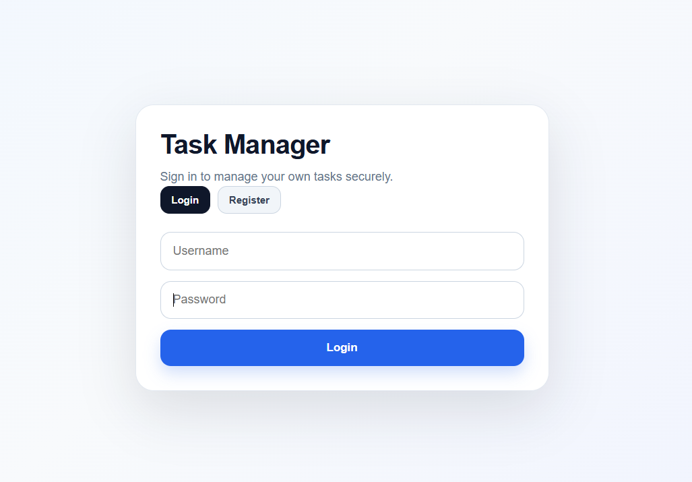
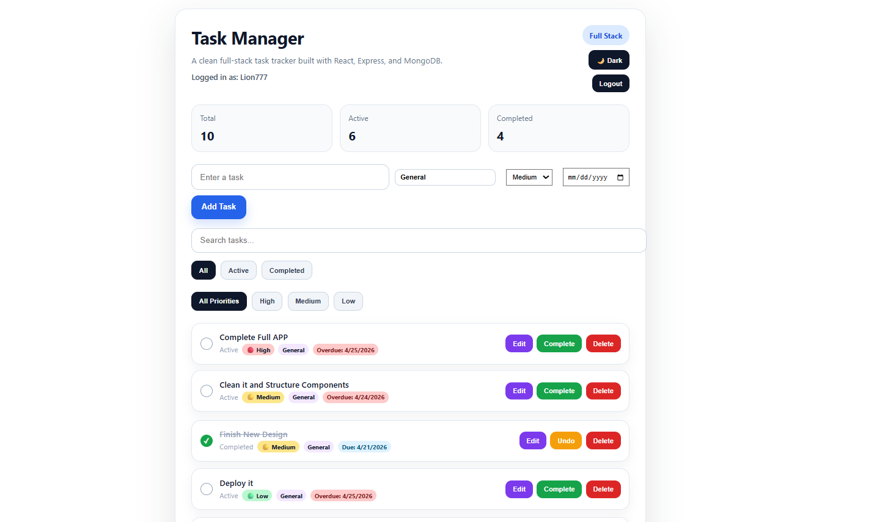
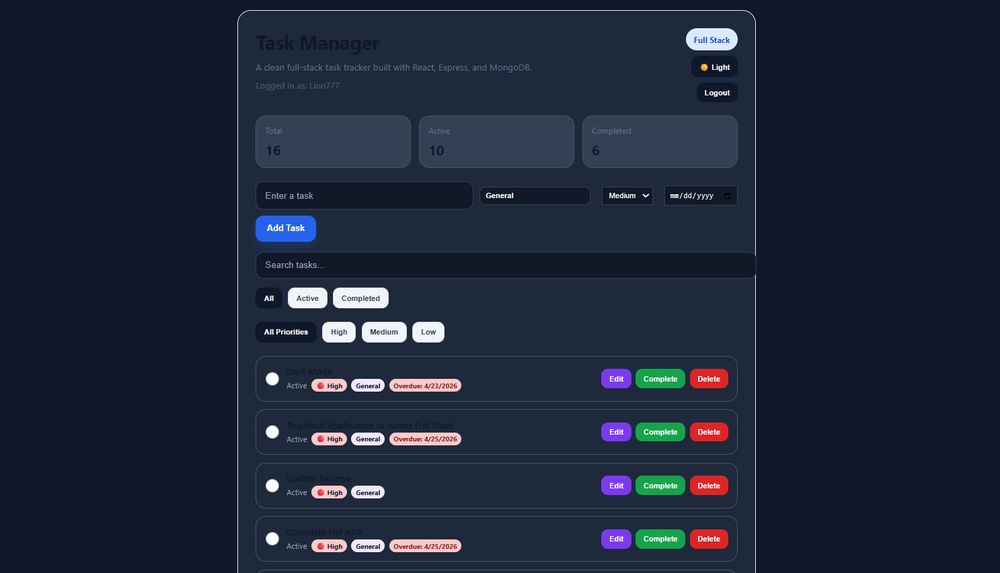

# 🚀 Task Manager App

A full-stack task management app built with React, Express, Node.js, and MongoDB. Users can register, log in, create tasks, edit tasks, assign categories, set priorities, add due dates, search/filter tasks, reorder tasks with drag-and-drop, and toggle light/dark mode.

## 🌐 Live Demo

https://task-manager-app-three-rho.vercel.app/

## 📌 Overview
This project is a full-stack CRUD task manager that allows users to create, view, update, and delete tasks through a responsive frontend connected to a deployed backend and cloud database.

## ✨ Features
- User authentication with JWT
- Create, edit, complete, delete tasks
- Task categories
- Priority levels: Low, Medium, High
- Due dates with overdue labels
- Search and filter by status/priority
- Drag-and-drop task reordering with saved order
- Light/dark mode with localStorage persistence
- Toast notifications
- Responsive UI polish with hover effects

- ## 🛠 Tech Stack
**Frontend:** React, JavaScript, CSS, React Hot Toast, @hello-pangea/dnd  
**Backend:** Node.js, Express.js  
**Database:** MongoDB / Mongoose  
**Deployment:** Vercel frontend, Render backend

## 📷 Screenshots

### Empty State

### Login


### Dashboard - Light Mode


### Dashboard - Dark Mode


## 🧪 How to Run Locally

### 1. Clone the repo
```bash
git clone https://github.com/mdp101191-rgb/task-manager-app.git

### 2. Start the backend
```bash
cd Backend
npm install
node server.js
```

### 3. Start the frontend
```bash
cd ../frontend
npm install
npm start
```

## 🔐 Environment Variables

Create a `.env` file in the `Backend` folder with:

```env
MONGO_URI=your_mongodb_connection_string
```

## 📚 What I Learned
- Built and deployed a full-stack app from frontend to backend
- Implemented JWT authentication and protected routes
- Connected React to a deployed Express/MongoDB API
- Debugged production deployment issues with Vercel and Render
- Added persistent drag-and-drop ordering
- Improved UI/UX with dark mode, toast notifications, and hover polish

## 🚀 Future Improvements
- Mobile layout improvements
- Per-user saved theme preference in MongoDB
- Task notes/subtasks
- Calendar view

## 👨‍💻 Author
**Marcos Peon**
